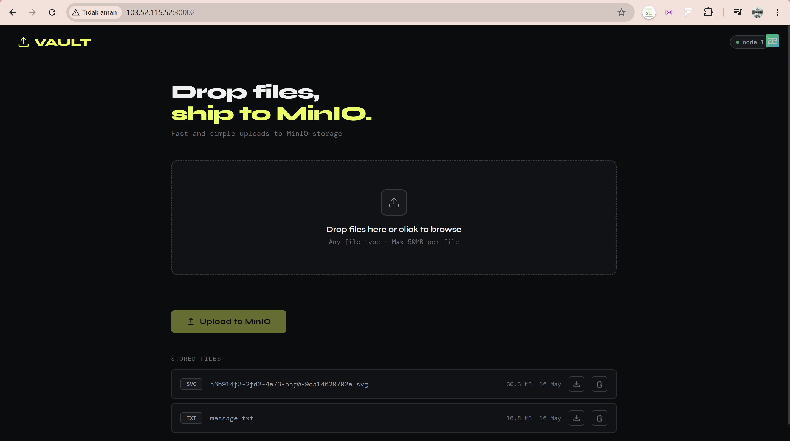
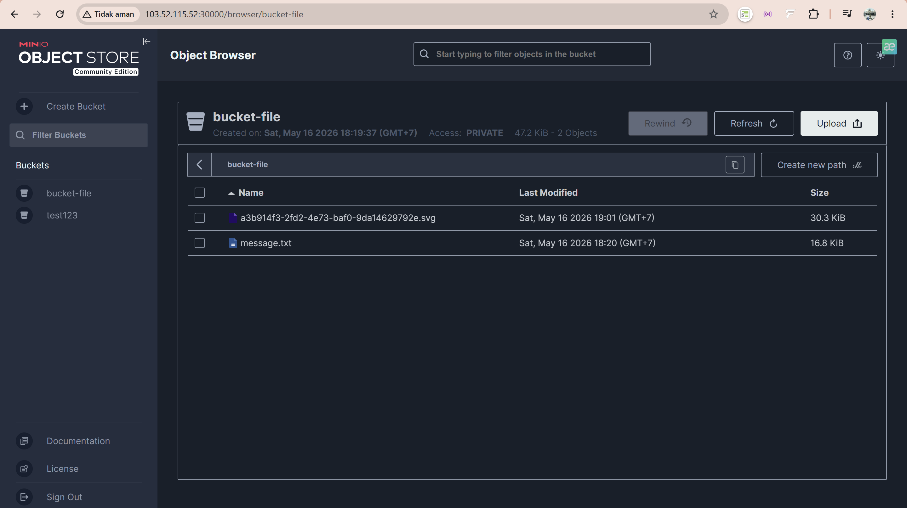

# Project - Drop files ship to MinIO





Project ini adalah implementasi object storage on-premise architecture menggunakan:

* Kubernetes
* MinIO
* Uploader app
* Docker
* Persistent Volume
* ConfigMap
* Service Networking

Flow app:

* User upload file ke Node.js app
* App connect ke MinIO menggunakan S3 API
* File disimpan ke object storage MinIO
* Data persistent menggunakan PVC Kubernetes

Project structure berdasarkan implementation : 
# Project Structure

```text
.
├── minio-kubeapps/
│   ├── minio-deployments.yml
│   ├── minio-pvc.yaml
│   ├── minio-svc.yaml
│   ├── minio-api-svc.yaml
│   └── .env
│
└── project-storage-apps/
    ├── Dockerfile
    ├── uploader-deployment.yml
    ├── app-svc.yaml
    ├── nginx.conf
    ├── package.json
    ├── package-lock.json
    ├── .env
    ├── .env.example
    ├── public/
    │   └── index.html
    └── src/
```

---


# 1. Kubernetes Cluster Setup

Menggunakan:

* kubeadm
* kubelet
* kubectl
* containerd

Install container runtime: 

```bash
sudo apt install -y containerd.io
```

Install Kubernetes package: 

```bash
sudo apt install -y kubelet kubeadm kubectl
```

Initialize cluster: 

```bash
kubeadm init \
--node-name elk-master \
--pod-network-cidr 10.25.0.0/16 \
--service-cidr 10.27.0.0/16
```

---

# 2. Install Flannel Networking

Flannel digunakan sebagai CNI networking Kubernetes. 

```bash
kubectl apply -f kube-flannel.yml
```

Function:

* pod communication
* pod routing
* overlay network

---

# 3. Setup Persistent Storage

Storage local dibuat menggunakan local-path provisioner.

Directory storage: 

```bash
/data/kubernetes-folder/kubernetes-project-1
```

PVC configuration:

```yaml
apiVersion: v1
kind: PersistentVolumeClaim
metadata:
  name: minio-pvc
spec:
  accessModes:
    - ReadWriteOnce
  storageClassName: local-path
  resources:
    requests:
      storage: 10Gi
```

PVC digunakan agar file MinIO tetap persistent walaupun pod restart.

---

# 4. Deploy MinIO Object Storage

MinIO deployment file:

```yaml
apiVersion: apps/v1
kind: Deployment
metadata:
  name: minio
spec:
  selector:
    matchLabels:
      app: minio
```

MinIO menggunakan:

* ConfigMap
* PVC
* volume mount `/data`

---

## MinIO ConfigMap

ConfigMap di define pada `.env`: 

```bash
kubectl create cm minio-config --from-env-file=.env
```

Environment:

```env
MINIO_ROOT_USER=dinda
MINIO_ROOT_PASSWORD=dinda123
```

---

# 5. MinIO Services

## A. Internal API Service

Digunakan uploader app untuk connect ke MinIO.

```yaml
kind: Service
type: ClusterIP
```

Port:

* 9000

Flow:

* internal cluster communication
* pod-to-pod communication

---

## B. MinIO WebUI Service

Digunakan browser/admin access.

```yaml
kind: Service
type: NodePort
```

Port:

* NodePort 30000

Access:

```text
http://103.52.115.52:30002/
```

---

# 6. Build Node.js Uploader App

Dockerfile: 

```dockerfile
FROM node:22-alpine

WORKDIR /app

COPY . .

RUN npm install

CMD ["npm", "start"]
```

Build image: 

```bash
docker build -t labibaadinda/uploader-storage:latest .
docker push labibaadinda/uploader-storage:latest
```

---

# 7. Node.js Application

Package.json:

```json
{
  "name": "minio-uploader",
  "description": "File uploader with MinIO"
}
```

Function:

* upload file
* connect to MinIO S3 API
* store object ke bucket

---

# 8. Application Environment

`.env`

```env
PORT=3001

MINIO_ENDPOINT=http://103.52.115.52:30000/
MINIO_ACCESS_KEY=dinda
MINIO_SECRET_KEY=dinda123
MINIO_BUCKET=bucket-file
```

App connect ke:

* ClusterIP MinIO
* bukan NodePort

Karena komunikasi terjadi internal Kubernetes network.

---

# 9. Deploy Uploader App

Deployment menggunakan ConfigMap. 

Create configmap:

```bash
kubectl create configmap app-storage \
--from-env-file="./.env"
```

Deploy:

```bash
kubectl apply -f uploader-deployment.yml
```

---

# 10. Expose Application

Service app: 

```bash
kubectl apply -f app-svc.yaml
```

Check service:

```bash
kubectl get svc
```

---

# 11. Deployment Flow

## Infrastructure Flow

```text
Linux Server
    ↓
Containerd
    ↓
Kubernetes
    ↓
Flannel Network
    ↓
StorageClass
    ↓
Persistent Volume
    ↓
MinIO Deployment
    ↓
NodeJS Uploader App
```

---

## Upload Flow

```text
Client Upload
    ↓
NodeJS Express App
    ↓
Multer Middleware
    ↓
AWS S3 SDK
    ↓
MinIO API Service
    ↓
MinIO Pod
    ↓
PVC Storage
```

---

# 12. Kubernetes Resources Used

| Resource     | Function                    |
| ------------ | --------------------------- |
| Deployment   | Run pod application         |
| Service      | Networking                  |
| ConfigMap    | Environment variable        |
| PVC          | Persistent storage          |
| Pod          | Container execution         |
| StorageClass | Dynamic volume provisioning |

---

# 13. Important Concepts

## Why ClusterIP for MinIO API?

Karena:

* lebih secure
* internal only
* pod communication
* tidak expose keluar cluster

---

## Why NodePort for WebUI?

Karena:

* browser access
* admin access
* debugging
* upload verification

---

# 14. Verification Commands

Check pod:

```bash
kubectl get pods
```

Check service:

```bash
kubectl get svc
```

Check pvc:

```bash
kubectl get pvc
```

Check logs:

```bash
kubectl logs -f <pod-name>
```

